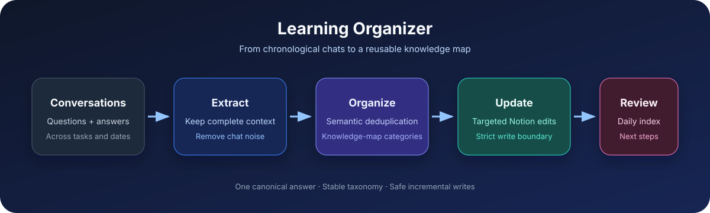

# Learning Organizer Skill

Turn scattered learning conversations into one structured, searchable Notion handbook.

把分散在多个对话中的学习问题与回答，整理成一份按知识体系组织、按日期回顾的 Notion 学习手册。



## Why this project

Chat histories are chronological, but learning is conceptual. Important answers become difficult to retrieve, repeated questions create noise, and isolated notes fail to form a mental model.

Learning Organizer converts conversation history into a durable knowledge structure:

```text
Accessible learning conversations
        ↓
Question + answer extraction
        ↓
Semantic deduplication
        ↓
Knowledge-map classification
        ↓
Targeted Notion update
        ↓
Daily learning index + next steps
```

## Features

- Collects question-and-answer pairs from accessible learning conversations
- Organizes knowledge by concepts instead of chat chronology
- Keeps a chronological index without duplicating full answers
- Merges semantically equivalent questions
- Adds prerequisites, related concepts, and next steps
- Marks time-sensitive claims for verification
- Uses targeted Notion edits and strict write boundaries
- Works across AI, product, language, business, research, and other learning domains

## Demo

### Source conversations

```text
Monday: “What is an API?”
Tuesday: “How do frontend and backend communicate?”
Friday: “Where should an API key be stored?”
```

### Structured handbook

```text
Software Foundations
├── What is an API?
├── How frontend and backend communicate
└── API key security

Daily Learning Index
├── Monday — API fundamentals
├── Tuesday — request flow
└── Friday — security boundary
```

Each question expands into a short answer, full explanation, prerequisites, related concepts, and the original learning date. See [the complete sample](examples/sample-output.md).

## Repository structure

```text
skill/organize-learning/
├── SKILL.md
├── agents/openai.yaml
├── references/classification-guide.md
└── assets/handbook-template.md
examples/
├── sample-input.md
└── sample-output.md
```

## Install

Install the skill from this repository's `skill/organize-learning` directory using Codex's Skill Installer, or copy that directory into your personal skills folder.

Then invoke it explicitly:

```text
$organize-learning Organize today's learning into my existing Notion handbook.
```

Natural-language requests such as “organize today's learning” can also trigger the skill when implicit invocation is enabled.

## Requirements

- Codex or another compatible agent-skills client
- Access to the source conversations or exported chat content
- A connected Notion workspace and an existing destination page

The skill asks for a destination when one cannot be identified safely. It never creates additional pages or changes sharing permissions without explicit permission.

## Design decisions

### One canonical answer

Complete answers live once in the knowledge map. The daily index links learning events without copying the entire answer.

### Stable taxonomy, flexible domains

The skill preserves an existing handbook taxonomy. When no taxonomy exists, it applies a compact cross-domain classification guide rather than inventing many shallow categories.

### Safe incremental writes

The workflow fetches the destination before and after editing, favors targeted updates, and refuses to broaden the write scope silently.

## Privacy and limitations

- Only accessible conversations can be processed.
- Deleted or unavailable chats cannot be reconstructed.
- External platforms require a connector, export, or pasted content.
- Do not store secrets or sensitive personal data in learning notes.
- Review generated notes before relying on high-stakes or time-sensitive claims.

## 中文说明

这个 Skill 解决的是“聊天记录按时间堆积，但知识需要按逻辑组织”的问题。

它会读取可访问的学习对话，提取问题和完整回答，进行语义去重，然后把内容放进已有 Notion 手册的知识分类中。同时维护每日学习索引、未解决问题和下一步行动。

公开版本不包含任何个人 Notion 地址、账号信息或固定知识分类，可以根据不同学习领域复用。

## License

MIT
